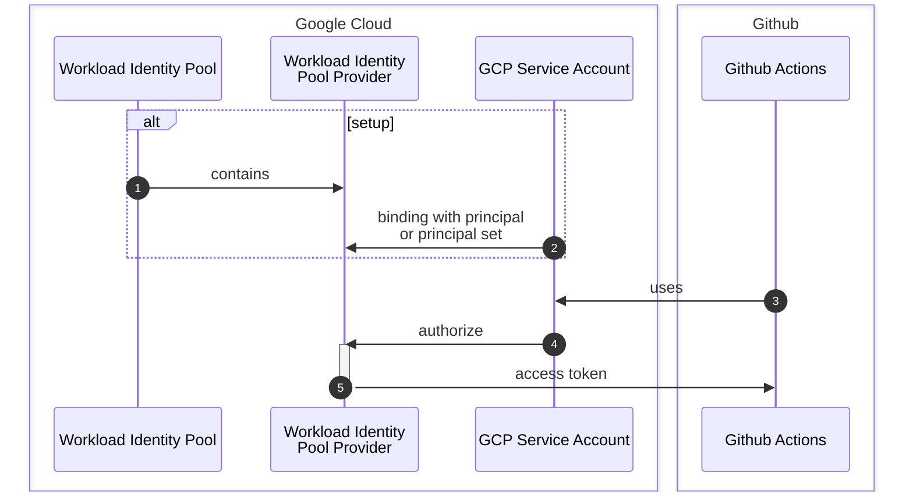

Speaking of CI/CD tools, I have some [old blogs about Google Cloud Build]({{ site.url }}/tags/google-cloud-build). Today we come to talk about another popular CI/CD tool which comes with Github, that is "Github Actions".

---

## What is "Github Actions"?

Github Actions is a CI/CD tool comes with Github. When we implemented our own apps in Github repositories, we can use this tool out-of-the-box. Similar to Google Cloud Build, we can control our workflows to run, test, and deploy with simple YAML files.

This is an official page of Github Actions.



---

## Start a first action

Github Actions just needs YAML files inside `.github/workflows` directory so we're gonna create a very simple workflow in one YAML file.

### Create a workflow file

The command below will create an empty file inside that directory.

```sh
mkdir -p .github/workflows
touch sample.yml
```

So we should have the file in the structure like this.

```md
.
└── .github
    └── workflows
        └── sample.yml
```

### Simple echo

We edit the content of `.github/workflows/sample.yml` file to just say "hello world", like this.

```yaml
name: "Sample workflow"

on:
  workflow_dispatch:

jobs:
  prepare:
    name: "prepare"
    runs-on: ubuntu-latest
    steps:
      - name: simple echo
        run: >
          echo "hello world"
```

- `name` is a name of this Github workflow.
- `on` is an event to run this workflow and `workflow_dispatch` means we can run this workflow manually.
- `jobs` is a section we define each of our jobs.
  - `prepare` is a job name as a local reference.
  - `name` here is the job name to display in the Github Actions page.
  - `runs-on` is an OS image to run this job. We can use `ubuntu-latest`, `windows-latest`, or `macos-latest` runners.
  - `steps` is a list of steps we want to execute in this job.

### Review the workflow

When we commit and push it to the default branch, we can find the new workflow here at the "Actions" tab of the repository.

{: style="max-width:66%;margin:auto;"}

> New workflow can be found when the workflow files are ready in the default branch.  
> Find out the default branch at the "Settings" tab, under "Branches" section.
{: .prompt-tip }

As we set `on` event to `workflow_dispatch`, we can run this workflow manually by selecting the branch and clicking the "Run workflow" button.

{: style="max-width:95%;margin:auto;"}

When the job ran completely (or failed), we can see the status and the job history like this.

{: style="max-width:95%;margin:auto;"}

### Review results

When we clicked the job name, we can see the details of the job.

This job names "prepare" and has only one step, "simple echo" so we can see only one box.

{: style="max-width:95%;margin:auto;"}

Clicking the "prepare" box will show the output of the step. There is "hello world" under the "simple echo" step.

{: style="max-width:95%;margin:auto;"}

---

## Some more configs

### Variables

We can define variables

```yaml
env:
  variable_a: "A"
  variable_b: 123 
```

and reference them in the workflow like this.

```yaml
env:
  text: "Hello world."

jobs:
  prepare:
    name: "prepare"
    runs-on: ubuntu-latest
    steps:
      - name: simple echo
        run: |
          echo "${{ env.text }}"
```

### Trigger events[^trigger]

```yaml
on:
  push:
    branches:
      - main
  pull_request:
    branches:
      - main
  workflow_dispatch: # manual trigger
```

- `push` event will trigger the workflow when we push to the given branch. It's `main` branch in the example above.
- `pull_request` event will trigger when we create a pull request to the given branch. It's also a `main` branch in the example.
- `workflow_dispatch` event to run manually.

### Job details



```yaml
job:
  <job_name>:
    name: "<job_name>"
    runs-on: <runner>
    steps:
      - name: "<step_name>"
        run: |
          <commands>
    needs: <job_name> # optional, to run after another job
    environment: <environment_name> # optional, to run in a specific environment
    output: # optional, to define outputs for the job
      <output_name>: ${{ steps.<step_id>.outputs.<output_name> }}
```



---

## Work with Google Cloud

### Workload Identity Federation

Workload Identity Federation[^wif] allows you to authenticate to Google Cloud without needing to store long-lived credentials in your GitHub repository. Instead, you can use short-lived tokens that are automatically generated.

In this blog, we are going to implement a simple Github workflow to check Google Cloud Storage files through GCP Workload Identity Federation. When the setup is ready, our Github actions can connect to the GCP as this diagram.



There are many ways to setup the GCP Workflow Identity Federation e.g. gcloud CLI[^gcpblog]. This blog will use Terraform[^tf] to create the resources.

### Create Workflow Identity Federation resources

### Checkout step

### Authenticating



### Debug OIDC Claims

debug[^debug]

```yaml
jobs:
  <job_name>:
    name: <step_name>
    runs-on: ubuntu-latest
    steps:
      - name: Debug OIDC Claims
        uses: github/actions-oidc-debugger@main
        with:
          audience: "${{ github.server_url }}/${{ github.repository_owner }}"
```

### Simple gcloud commands

{:style="max-width:75%;margin:auto;"}

---

## Repo

asd[^setupgcloud]



---

## References

- [google-github-actions/auth: A GitHub Action for authenticating to Google Cloud.](https://github.com/google-github-actions/auth)
- [Quickstart for GitHub Actions - GitHub Docs](https://docs.github.com/en/actions/get-started/quickstart)
- [actions/runner: The Runner for GitHub Actions :rocket:](https://github.com/actions/runner?tab=readme-ov-file)
- [Deploy to Cloud Run with GitHub Actions](https://cloud.google.com/blog/products/devops-sre/deploy-to-cloud-run-with-github-actions/)
- [google cloud platform - github actions to GCP OIDC error: 403 'Unable to acquire impersonated credentials' \[principalSet mismatch with the Subject claim\] - Stack Overflow](https://stackoverflow.com/questions/76346361/github-actions-to-gcp-oidc-error-403-unable-to-acquire-impersonated-credential)
- [Github actions 'Unable to acquire impersonated credentials' from GCP OIDC: error403 \[principalSet mismatch with the Subject claim\] · Issue #310 · google-github-actions/auth](https://github.com/google-github-actions/auth/issues/310)

[Principal types](https://cloud.google.com/iam/docs/workload-identity-federation#principal-types)
[Delete a provider](https://cloud.google.com/iam/docs/manage-workload-identity-pools-providers#delete-provider>)
[Allow your external workload to access Google Cloud resources](https://cloud.google.com/iam/docs/workload-download-cred-and-grant-access?_gl=1*1wpewb4*_ga*MTQ0ODU0NDYzMy4xNjc4NjM4OTE0*_ga_WH2QY8WWF5*czE3NTI2OTU1NjckbzE5JGcxJHQxNzUyNjk1NzE3JGoxMSRsMCRoMA..#service-account-impersonation)

[^gcpblog]: [Secure your use of third party tools with identity federation \| Google Cloud Blog](https://cloud.google.com/blog/products/identity-security/secure-your-use-of-third-party-tools-with-identity-federation)
[^debug]: [github/actions-oidc-debugger: An Action for printing OIDC claims in GitHub Actions.](https://github.com/github/actions-oidc-debugger)
[^trigger]: [Triggering a workflow - GitHub Docs](https://docs.github.com/en/actions/how-tos/writing-workflows/choosing-when-your-workflow-runs/triggering-a-workflow)
[^wif]: [Workload Identity Federation  \|  IAM Documentation  \|  Google Cloud](https://cloud.google.com/iam/docs/workload-identity-federation)
[^setupgcloud]: [google-github-actions/setup-gcloud: A GitHub Action for installing and configuring the gcloud CLI.](https://github.com/google-github-actions/setup-gcloud?tab=readme-ov-file)
[^tf]: [google_iam_workload_identity_pool_provider \| Resources \| hashicorp/google \| Terraform \| Terraform Registry](https://registry.terraform.io/providers/hashicorp/google/latest/docs/resources/iam_workload_identity_pool_provider)
