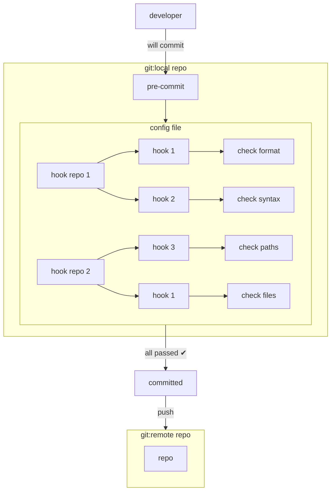

Git is a must for developers. It is easy to store our source code, track, and review, but have you been ensure that you pushed clean code aligned with your team's standards to the repo?

---

## Introduce "pre-commit"

`pre-commit` is a tool to automatically run scripts to **lint**, **check**, **validate** our source code. Once setup it works so well with **Git** and let us know before committing unclean code. That's why it's called `pre-commit`.

The concept is to have a configuration with desired hooks. Each hook will trigger a script to check our code, and all hooks in the configuration **must be run before** we commit the code to repo. If any hook fails, we can see and fix it then commit and push again.



Simple right?

Here is the webpage of `pre-commit`.



---

## Setup

We can setup `pre-commit` with just 1-2-3 like this.

### 1. Install pre-commit

We can install `pre-commit` in many ways. I prefer installing it via [homebrew](https://formulae.brew.sh/formula/pre-commit), and there is `pip` way as well.

```sh
# install via homebrew
brew install pre-commit

# install via pip
pip install pre-commit

# verify pre-commit
pre-commit --version
pre-commit -V 
```

### 2. Install pre-commit hooks

After installing `pre-commit`, we have to install its hooks into our Git local repo.

```sh
pre-commit install

# output should be:
# pre-commit installed at .git/hooks/pre-commit
```

### 3. Create a config file

Last, tell `pre-commit` what to do. It needs a configuration file named ".pre-commit-config.yaml". We can create an empty file then add contents ourselves or create from sample like this.

```sh
# create an empty config file
touch .pre-commit-config.yaml

# create a config file from sample
pre-commit sample-config > .pre-commit-config.yaml
```

This is the sample configuration from `pre-commit sample-config`.

```yaml
# See https://pre-commit.com for more information
# See https://pre-commit.com/hooks.html for more hooks
repos:
-   repo: https://github.com/pre-commit/pre-commit-hooks
    rev: v3.2.0
    hooks:
    -   id: trailing-whitespace
    -   id: end-of-file-fixer
    -   id: check-yaml
    -   id: check-added-large-files
```

We can add yaml schema from [schema store](https://www.schemastore.org/pre-commit-config.json) like this to validate the configurations.

```yaml
# yaml-language-server: $schema=https://www.schemastore.org/pre-commit-config.json
repos:
- repo: ...
  hooks:
    - ...
```

---

## Run it

Let's say I leave a trailing space in the Python file. When I try to commit it, the error should be shown like this.

{: style="max-width:100%;margin:auto;" }

However, we can execute hooks without having to commit first by running these commands.

```sh
# pre-commit on stage files
pre-commit run

# pre-commit on all files regardless of staged 
pre-commit run --all-files
pre-commit run -a
```

- Clean pre-commit cache:
    pre-commit clean

- Update pre-commit configuration file to the latest repos' versions:
    pre-commit autoupdate

---

## Integrated with Github Actions

---

## Hook types

We can set a repo to be Github repo or `local`. `local` is great and flexible when we want to run our own scripts.

### Repo hooks

``` yaml
repos:
  - repo: <hook repo url> 
    rev: <branch>
    hooks:
      - id: <hook id>
```

### Local hooks

```yaml
repos:
  - repo: local
    hooks:
      - id: <hook id>
        name: <hook name>
        entry: <entry command>
        language: system
        types: [<hook type>]
        pass_filenames: <true | false>
```

---

## Interesting hook sites

- [pre-commit-hooks](https://github.com/pre-commit/pre-commit-hooks): basic hooks for Python,
- [pre-commit-trivy](https://github.com/mxab/pre-commit-trivy): hooks for scanning vulnerabilities, secrets, and misconfigurations.
- [Collection of git hooks for Terraform to be used with pre-commit framework](https://github.com/antonbabenko/pre-commit-terraform)
- [Github topic: pre-commit](https://github.com/pre-commit/pre-commit-hooks)
- [Github topic: precommit](https://github.com/topics/precommit)

---

## Repo


