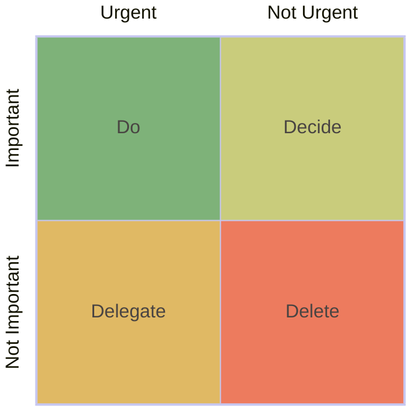

Eisenhower matrix

- JIRA
- Trello
- Obsidian
- To-do apps

---

## My tricks to handle stress

Extract
:  Find out what is the real problem.

Retract
:  Step back

Distract
:  If can't solve at the time, distract myself to think about other things.
