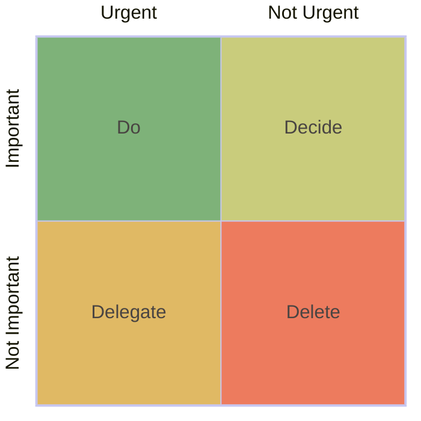

So far I have worked with people. Both engineers and business person. There are various concerns I have thorough the process, either work-related and personal ones.

I'd like to share how I tackle them in the mean time I keep my own calmness.

---

## Before problems

In case you don't have idea what is **Eisenhower matrix**, this is a simple quadrant diagram that helps us classify how could we deal with this problem.

Important & urgent problem: Do
: asd

Important but not urgent problem: Decide
: asd
  JIRA
  Trello
  Obsidian
  To-do apps
  plan A-B-C

Not important but urgent problem: Delegate
: asd

Not important nor urgent: Delete
: asd

---

## Solving problems

- jot down my ideas because many times my ideas are gone with the wind so I need to note them with my handy tools. Note apps in my phone is a quick resort I use the most.

### My de-stress methods

When I have to deal with some problems but I feel I'm cornered and can't figure the way out, I have my own 3 ways to exit that situation.

1. Extract
:  I think I can solve that then I will find out what is the real problem.

2. Retract
:  I usually have my own time frame for a problem. When I use up the whole time frame, I would step back and discuss other people. They could be my teammate, my leader, my manager, or my family if it's personal. Two heads are better than one right?

3. Distract
:  If can't solve at the time, distract myself to think about other things.
  When we're cornered, we can see only the wall.

---

## After solving

After I completed my works or tasks, I will back to review what I faced, what I fel, what ideas I had, what I jot down during the works, and what feedback I got.

This review session could be done periodically or occasionally, depends on my own comfort and availability but I try to make it not too late as I will lose from my memory.

---

## References

- [The Eisenhower Matrix: How to Prioritize Your To-Do List \[2025\] • Asana](https://asana.com/resources/eisenhower-matrix)
