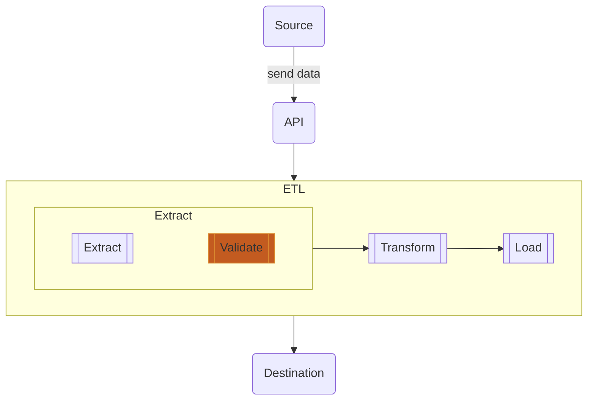

Data contract is a part of data integration. It describes "contract" or agreement that we need to communicate between sources and destinations in order to make a trusted and reliable pipeline by having:

- Responsible persons (who)
- Data subjects (send what)
- Methods and channels (on which way)
- Frequency (when)
- Data schemas (how it looks like)

So I would like to demo some basic data contract extraction here.

---

## Data contract as an API

Let's review a simple flow of how can we integrate data contracts in an ETL. The flow is like this.

Yes, we will highlight "validation" as it's a must that we will talk very soon.

---

## Before we go next

This blog here is showing real-time integration using NodeJS as an API. Validate the request payload with AJV library.

For Python, please visit [this link]().

---

## API swagger

API swagger represents how can people call our APIs, like a library of APIs. Basically it can be created using just a configuration file such as YAML or JSON, here we are using YAML.

Also we're using VSCode as an editor.

### 1. VSCode plugin: OpenAPI Editor

To make life easier, this plugin in VSCode helps writing API definition and reviewing our swagger with few steps.



### 2. Generate a basic YAML file

In VSCode, when the OpenAPI plugin is enabled, open the palette and select "create".

After selection, we should see a new draft OpenAPI YAML file like this.

We can click at a preview icon and see swagger like this.

### 3. Create new path

Then I would love to have a new path, like `people`.

Check in the preview, it looks good.

So I will save this file and name "people.yml".

I will write a blog of this OpenAPI configuration file in details later.

---

## Making an app with validation

To validate an incoming request, for instance someone wants to `POST` some information into that API, we need to "validate" in the extract layer.

Validation means we are checking if the request payload is acceptable by schema compatibilty. This field must be string and that field must be integer, kind of.

We are using Ajv to perform validation right here.



### 1. Create a javascript app

Initiate "index.js" as follows

And build "package.json".

After `npm install`, we now have an app listening port 4001 and will have a new endpoint `/people`.

### 2. Read the contract

We have "people.yml" from the previous step, so read it out with `js-yaml` library.

### 3. Setup AJV

We listed the contract "people.yml" then we register it as follows.

- `strict`: false to disable restrictions or throwing errors from some keywords or undefined formats.
- `addFormat()` to include formats defined by JSON Schema specification.
- `AJV.addSchema(contract, key)` to add our contract with a key.

### 4. Validate a request payload

To validate incoming request payload, we have to do so inside the respective path. For this example, we are receiving data through path `/people` then we add validation inside it.

- `AJV.compile()` to setup a function for a specific contract.
- `$ref: ...` to specify structure of the contract in order to validate.  
  In this case we are looking at the contract key `people` and refer inside with `#` followed by the real definition which is `/components/schemas/people`.
- `validator()` is a new function we created from `AJV.compile()` and use it to validate the payload.
- if `validator()` return "true", it means the payload is correct by the contract.
- if `validator()` return "false", it means the payload has some fields violating the contract. We can see what happened with the property `.errors`.

### 5. Complete API with validation

Assemble them all into this.

### 6. Test

Now it's time for testing and we can curl like this.

or use a preferred http tool.

#### a. The payload is fine

{:style="max-width:66%;margin:auto;"}

#### b. The payload has incorrect field type

{:style="max-width:66%;margin:auto;"}

#### c. The payload misses some required fields

{:style="max-width:66%;margin:auto;"}

---

## Manage multiple contracts

How to handle several contracts?

Let's say we have 2 endpoints, `people` and now `pets` also 2 contract files. We would have some improvement to optimize the validation on multiple contracts.

`people` contract is as above and here is `pets` contract.

This is an idea.

- List the contract files in YAML and `AJV.addSchema()` one by one. The contract keys are the same as filenames.
- Write a generic function, receiving contract key (`contract_key`), request payload (`body`), and response object (`res`).
- Inside that generic function, it works as previous: compile, validate, and check result.
- In each endpoints; `/people` and `/pets`, call the generic function by supply `people` and `pets` as contract key respectively.

Here is the complete code.

Test some cases for `pets` for error expected.

{:style="max-width:66%;margin:auto;"}

---

## Repo

This is my repo for the example of this blog.



---

## References

- [A Guide to Data Contracts](https://www.striim.com/blog/a-guide-to-data-contracts/)
- [OpenAPI (Swagger) Editor](https://marketplace.visualstudio.com/items?itemName=42Crunch.vscode-openapi)
- [What is OpenAPI?](https://www.openapis.org/)
- [Ajv JSON schema validator](https://ajv.js.org/)
- [ajv-formats](https://ajv.js.org/packages/ajv-formats.html)
- [Ajv JSON schema validator - Prohibit ignored keywords](https://ajv.js.org/strict-mode.html#prohibit-ignored-keywords)
