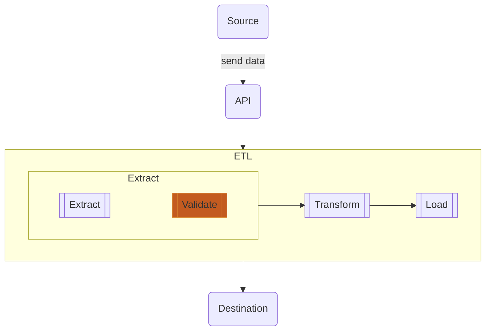



Last blog we talked about data contracts and implementation in NodeJS. This time we will do the same but in Python.

In case of the NodeJS version, click [the link here]()

---

## Recap

There is a validation step in extract layer in ETL. It is to make sure incoming data is sufficiently qualified to be in our databases.

In this case, we are creating an API to retrieving data and validate it. The tools we need are OpenAPI and Python library for validation, `jsonschema`.

---

## API Swagger

We are using the same API definition file, `people` and also `pets`.













---

## Making an app with validation

Introduce `jsonschema`. This library helps us validate an object with expected schema. It works as same as AJV in NodeJS.



### 1. Create a python app

Begin with a sample Flask app.

And install the requirements.

It should show like this when execute.

### 2. Read the contract

Start with just a single contract, `people`.

As you see, at line 6-7 we are reading the contract file and store into variable `contract`.

### 3. Validate a request payload

- line 9: get the payload using `request.get_json()`.
- line 10: refer the raw contract at `/components/schemas/people`.
- line 11: validate the payload and raw contract using `jsonschema.validate()`.
- line 12: return `200` as "OK" when all process above is okay. Otherwise return "500 Internal Server Error" as below.

{:style="max-width:66%;margin:auto;"}

### 4. Handling errors

Hmmm the error above is bulky and unconcise. We should improve like this.

- If everything is okay, it should return `200` in `try` block.
- If there is a validation error, it should return `400` with message from `jsonschema.ValidationError.message` in the first `except` block.
- Anything else, return `400` and print the log into console.

### 5. Complete API with validation

### 6. Test

#### a. The payload is fine

{:style="max-width:66%;margin:auto;"}

#### b. The payload has incorrect field type

{:style="max-width:66%;margin:auto;"}

#### c. The payload misses some required fields

{:style="max-width:66%;margin:auto;"}

---

## Manage multiple contracts

A second ago we validate only `people` contract. Now we have `pets` and want to validate both.

Therefore, we can prepare a generic function like this.

- line 8-13: read contract files and store in a `dict`, giving filename as keys.
- line 16-30: refactor the validation into a generic function, require contract key and payload as parameters.

And call this generic function from each endpoint.

The complete code is here.

Let's make a call to this API with an error expected.

{:style="max-width:66%;margin:auto;"}

Good. Our simple API with contract validation is ready.

---

## Repo

Full code is located here.


