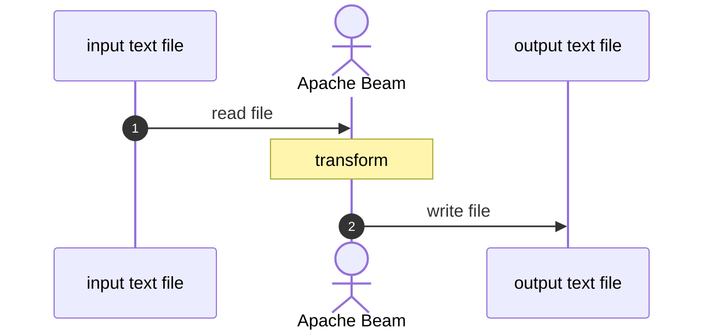
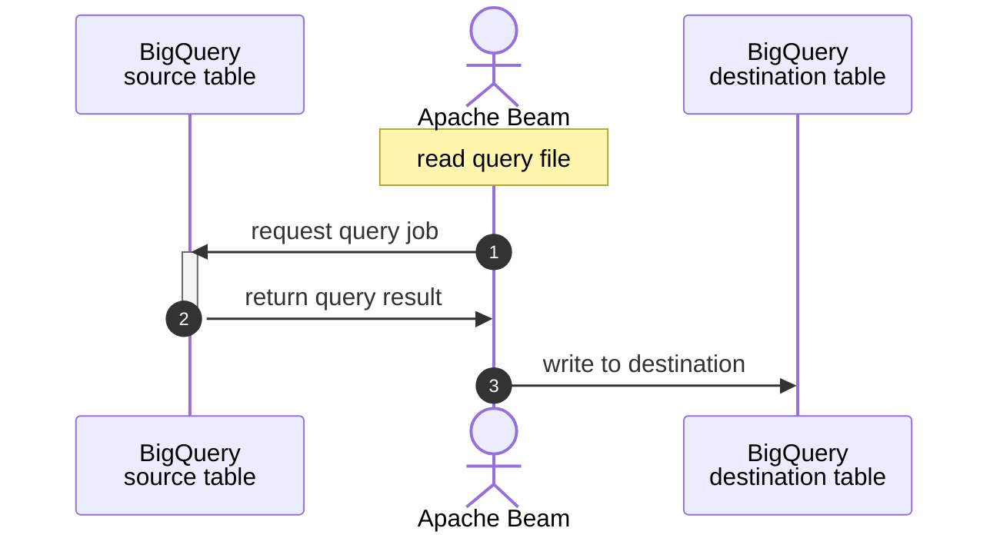
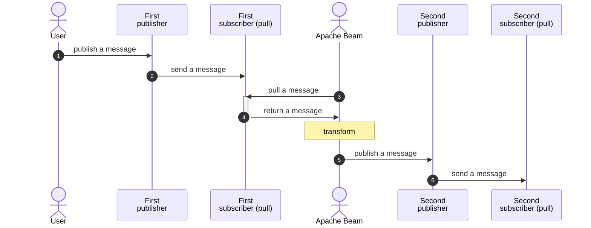

[expand-series]

  1. [Let's try: Apache Beam part 1 - simple batch]()
  1. [Let's try: Apache Beam part 2 - draw the graph]()
  1. [Let's try: Apache Beam part 3 - my own functions]()
  1. [Let's try: Apache Beam part 4 - live on Google Dataflow]()
  1. [Let's try: Apache Beam part 5 - transform it with Beam functions]()
  1. Let's try: Apache Beam part 6 - instant IO
  1. [Let's try: Apache Beam part 7 - custom IO]()
  1. [Let's try: Apache Beam part 8 - Tags & Side inputs]()

[/expand-series]

Apache Beam provides inputs and outputs for PCollection in many packages. We just import and call them properly and get the job done.

This blog we will see 3 IO (input/output) modules that I usually work with.

---

## 1. Text (Google Cloud Storage)

A very basic one.

Beam has `beam.io` library and there are `ReadFromText()` and `WriteToText()` in order to read and write a text file respectively.

We also use them to work with files in Google Cloud Storage as they are text files.

- line 14: `ReadFromText()` to read a file at `input_file` which is from `argparse`.
- line 16: `WriteToText()` to create a file at `output_file`.

This pipeline can be drawn to diagram like this.

---

## 2. Database (Google BigQuery)

Another Google Cloud service that I use so often.

- line 14: `ReadFromBigQuery()` and supply `query=` to run the query.
- line 18: supply `temp_dataset=` in order to allow Beam can use the given dataset to store temporary data generated by Beam.

> If we don't supply `temp_dataset=`, Beam will automatically create a new dataset every time it runs.
{: .prompt-info }

*Beam automatically generates temporary datasets.*

This pipeline is as the diagram below:

---

## 3. Messaging (Google Cloud Pub/Sub)

Come to real-time things.

Google Cloud Pub/Sub is one of source and sink integrated with Beam. We are able to setup Beam to listen to a publisher or a subscriber by design.

For this time, I setup Beam to read data from a subscriber then transform before send to another topic.

- line 10: set the option with `streaming=True`. Allow Beam to run as a streaming pipeline.
- line 15: `ReadFromPubSub()` by reading from a specific subscriber.
- line 26: After transforming, share the result to a topic through `WriteToPubSub()`.

> Make sure the PCollection is a byte string by using `.encode()` before throw them to `WriteToPubSub()`.
{: .prompt-warning }

We can test publish something on the topic and pull from the subscription. Like this.

`originMessageId` is parsed from the topic in transformation step.

This diagram describes the flow of this Beam pipeline.

---

## Repo

Feel free to review full code [here](https://github.com/bluebirz/sample-beam/tree/main/06-io).

---

## References

- [apache_beam.io.textio module](https://beam.apache.org/releases/pydoc/current/apache_beam.io.textio.html)
- [apache_beam.io.gcp.bigquery module](https://beam.apache.org/releases/pydoc/2.36.0/apache_beam.io.gcp.bigquery.html)
- [Dataflow - BigQuery autodetect?](https://stackoverflow.com/questions/67633861/dataflow-bigquery-autodetect/67643669#67643669)
- [apache_beam.io.gcp.pubsub module](https://beam.apache.org/releases/pydoc/2.29.0/apache_beam.io.gcp.pubsub.html)
