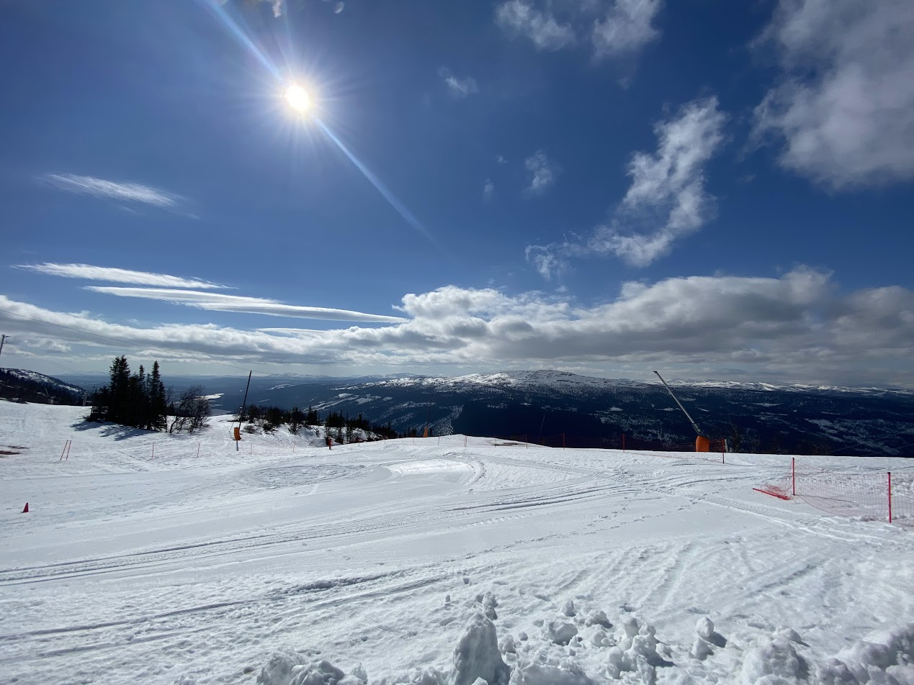

[expand-series]

  1. [Let's try: Apache Beam part 1 - simple batch]()
  1. [Let's try: Apache Beam part 2 - draw the graph]()
  1. [Let's try: Apache Beam part 3 - my own functions]()
  1. [Let's try: Apache Beam part 4 - live on Google Dataflow]()
  1. [Let's try: Apache Beam part 5 - transform it with Beam functions]()
  1. [Let's try: Apache Beam part 6 - instant IO]()
  1. Let's try: Apache Beam part 7 - custom IO
  1. [Let's try: Apache Beam part 8 - Tags & Side inputs]()

[/expand-series]

## h2

{:style="max-width:75%;margin:auto;"}

---

### h3

---

#### h4
