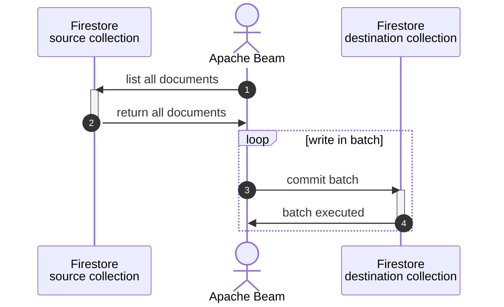

[expand-series]

  1. [Let's try: Apache Beam part 1 - simple batch]()
  1. [Let's try: Apache Beam part 2 - draw the graph]()
  1. [Let's try: Apache Beam part 3 - my own functions]()
  1. [Let's try: Apache Beam part 4 - live on Google Dataflow]()
  1. [Let's try: Apache Beam part 5 - transform it with Beam functions]()
  1. [Let's try: Apache Beam part 6 - instant IO]()
  1. Let's try: Apache Beam part 7 - custom IO
  1. [Let's try: Apache Beam part 8 - Tags & Side inputs]()

[/expand-series]

As we talked in the last blog, part 6 - instant IO, that Apache Beam prepares many IO packages out-of-the-box for us to freely connect to our datasources.

But in real world, there would be some cases we need to connect to some sources that Apache Beam doesn't have the IO packages for.

This blog is for that. Let's see how can we implement IO package in our own styles.

---

## Before go next

This blog is about writing a custom IO package. And this is connecting Google Firestore as a source.

**Google Firestore** is a NoSQL database from Google Cloud Platform. Strong at real-time sync and seamlessly integrate with other Google Cloud Services. It is popular in several enterprises e.g. online gaming business and mobile app development.



---

## Read from Google Firestore

### code snippet

Starts from reading all documents within a specific collection.

- line 8: connect to the default database with default credentials.
- line 11: `stream()` all documents from the specific collection.
- line 13: print `id` and contents of each document with `to_dict()`.

### implement in Beam

When it comes to Beam, we can write a class to read from Firestore by inherit `apache_beam.io.iobase.BoundedSource`. Refers to this doc.



- line 22: `init()` the class and receive a target collection to read, a reading limit, and database name.
- line 33: `estimate_size()` to estimate the **total size** of data in bytes before performing decompression or other processing.
- line 36: `get_range_tracker()` to report progress and perform dynamic splitting of sources.
- line 44: `read()` to read data, applied from the code snippet above.
- line 61: `split()` to split your finite data into bundles of a given size.

In order to call this class, just write `beam.io.Read(FireStoreReaderFromCollection("collection_name"))`.

---

## Write to Google Firestore

### code snippet

We are making a batch write to Firestore.

- line 8: connect to the default database with default credentials.
- line 11: define maximum number of element for a batch.
- line 12: prepare a batch of data as an array.
- line 14: internal method to commit a batch of data to Firestore
- line 16: iterate data in batch to prepare to write using `batch.set()`.
- line 21: commit all writes in the batch.
- line 29: iterate each element in data and load into batch.
- line 31: call internal method to commit the batch when number of element in the batch reaches maximum (define at line 11).
- line 33: call internal method again if there are element leftover in the batch.

### implement in Beam

In this case, we can use `apache_beam.DoFn`.

- line 21: `init()` the class and receive a target collection to write, database name, and maximum elements in a batch.
- line 31: `setup()` will be called automatically by Beam when "the instance is deserialized" or say when the DoFn instance is ready after the worker is started up.  
  Beam doc suggests to do setup connection with databases, networks, or other here.
- line 40: `start_bundle()` will be called automatically by Beam each time **an element bundle is going to be processed**.  
  Element bundles are PCollection divisions that automatically divided by the runner.  
  We use this to declare and clear the current batch.
- line 43: `finish_bundle()` will be called  automatically by Beam each time **an element bundle is finishing the process**.  
  We use this to the commit the batch.
- line 47: `process()` will be called automatically by Beam each time **an element is going to be processed**.  
  This method is called after `start_bundle()` and before `finish_bundle()`. Here we add an element into the current batch.
- line 52: `commit_batch()` to commit the current batch to write in Firestore.  
  Clear the current batch after commit completed.
- line 62: `teardown()` will be called automatically by Beam when "the instance is shutting down" or say when the `DoFn` is finished.  
  Beam doc suggests to do close connection or else but we have to do nothing here so I leave it passed.

In order to call this `DoFn`, write `beam.ParDo(FireStoreWriterToCollection("collection_name"))`.

---

## Pipe them in Beam

We now can create a pipeline of both classes following this diagram.

Let's arrange the files like this:

And prepare "main.py" to call the classes:

Before run, we have one collection, "customers".

{:style="max-width:75%;margin:auto;"}

After run, we will see the second collection with same documents, "new_customers".

{:style="max-width:75%;margin:auto;"}

---

## Repo



---

## References

- [Developing I/O connectors for Python](https://beam.apache.org/documentation/io/developing-io-python/)
- [Get all documents in a collection](https://firebase.google.com/docs/firestore/query-data/get-data#get_all_documents_in_a_collection)
- [Batched writes](https://firebase.google.com/docs/firestore/manage-data/transactions#batched-writes)
