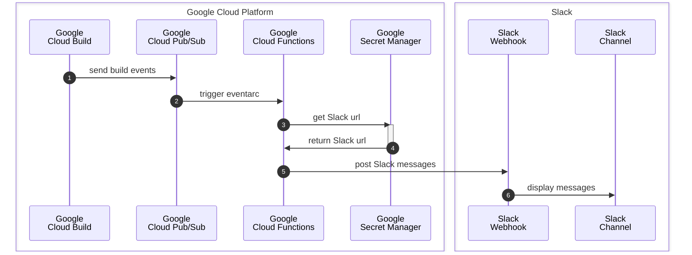

I have a blog about sending build results from Google Cloud Build to Google Chat ([here]()). And this is a version for Slack.

In case you don't aware of, Slack is a popular messaging app among developer teams and companies with its feature-rich more than just texting between individuals and groups. It also offers APIs that developers love to use for their wonderful automated pipelines.

And Google Cloud Build is a main CI/CD tool in Google Cloud Platform. It's super easy to build your code into services in GCP.

---

## Diagram



---

## Services we need

1. Google Cloud Build
1. Google Cloud Pub/Sub topic "cloud-builds"
1. Slack app or webhook API
1. Google Secret Manager to store Slack API as a secret
1. Google Cloud Functions as a main operator

---

## Steps

### 1. Prepare Cloud Build

First of all, we need to enable Google Cloud Build API and Google Cloud Pub/Sub API. There must be one topic called "cloud-builds" and Google Cloud Build will automatically publish build events through that.

{:style="max-width:75%;margin:auto;"}

### 2. Prepare Slack webhook API

In this blog we will try Slack webhook API solution. Another is using Slack app.

We can follow the steps to create a webhook url in the link below.



We should get an webhook url in the "Incoming webhook" page in settings and it's supposed to be like this "<https://hooks.slack.com/services/ABC/DEF/GHIJ1234>".

{:style="max-width:75%;margin:auto;"}

### 3. Store webhook in Google Secret Manager

We need to save it secret in Google Secret Manager and retrieve in Google Cloud Functions as an environment variable.

{:style="max-width:75%;margin:auto;"}

### 4. Design Slack message template

Go to Slack Block Kit. Here we can design our own style messages that we want to see in Slack channels.



Here is my sample template for this operation.

<script src="https://gist.github.com/bluebirz/0e1df748bc70b080392952e42031d6ba.js?file=template.j2"></script>

### 5. Implement Google Cloud Functions

The last step is to implement the main Cloud Functions.

My Cloud Functions uses Python to receive messages from the topic "cloud-builds" which forwards from Google Cloud Build. Then extract the message and assemble to a new Slack message and send out through the Slack webhook API.

<script src="https://gist.github.com/bluebirz/0e1df748bc70b080392952e42031d6ba.js?file=main.py"></script>

### 6. Deploy Google Cloud Functions

Just using the command to deploy directly.

```sh
gcloud functions deploy NAME [flags]
```

For full scripts, please review "cloudbuild.yaml" in the repo link at the bottom.

---

## Real outputs

When everything is done, we should see the result like this.

{:style="max-width:75%;margin:auto;"}

---

## Repo


