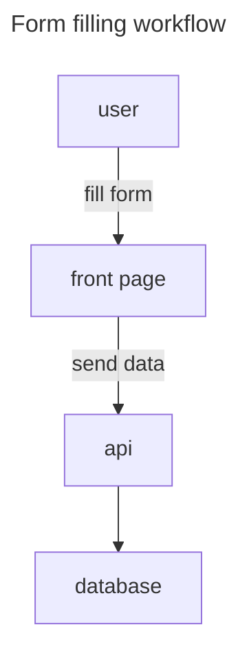
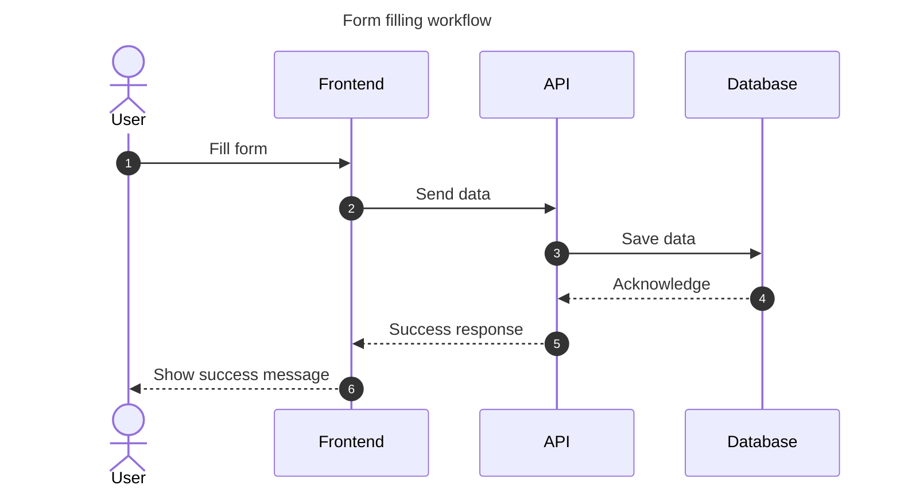
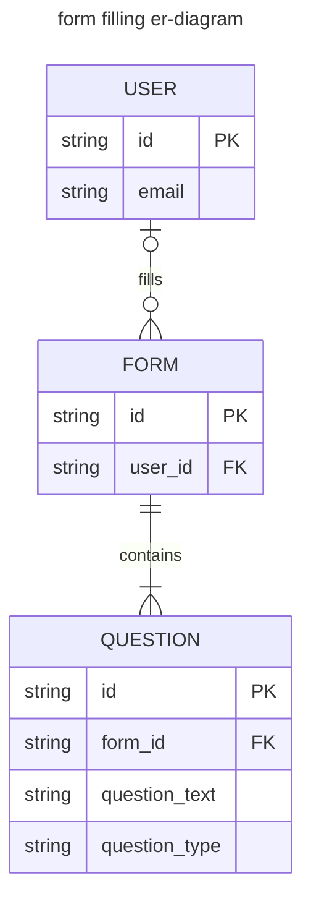
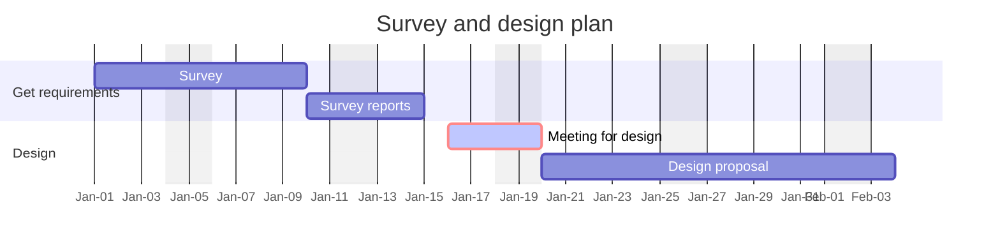
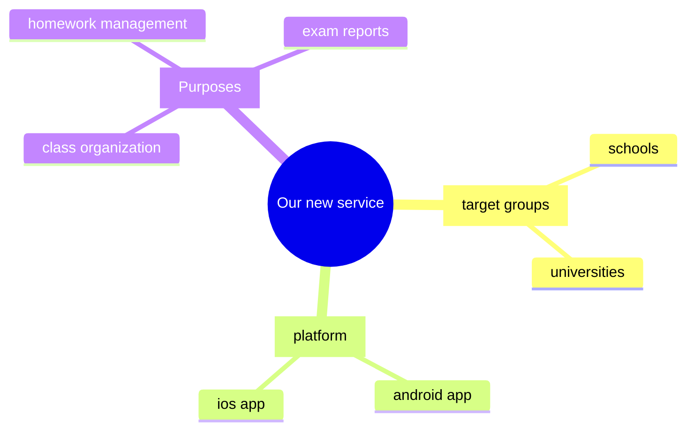

When it comes to documentation, my goal is to explain the ideas and design into something easiest way possible to comprehend. One answer is diagrams because one picture says more than thousand words.

---

## Introduce Mermaid

In case you don't know Mermaid before, Mermaid is a script in Markdown to render diagrams and flowcharts. We can write Mermaid diagram in Markdown files and Github supports it so we can include our diagrams in README page to increase readability.

Here is Mermaid's official website.



In order to write and preview the diagrams, we can start writing in this site.



Or install Mermaid preview plugins in your favorite IDEs, such as:

- VSCode: [Mermaid Chart by mermaidchart.com](https://marketplace.visualstudio.com/items?itemName=MermaidChart.vscode-mermaid-chart)
- VSCode: [Markdown Preview Mermaid Support by Matt Bierner](https://marketplace.visualstudio.com/items?itemName=bierner.markdown-mermaid)
- Neovim: [markdown-preview.nvim by iamcco](https://github.com/iamcco/markdown-preview.nvim)

---

## Syntax of Mermaid

Mermaid supports many diagram types. Each type has its own pattern but we can start from this in a Markdown file.

````md
```mermaid
---
title: some title
config: 
  some: config
---
<diagram type>
  <diagram content>
```
````

Let's take a look at some sample diagrams.

---

## Examples of Mermaid diagrams

### Flowchart

A very basic one. I usually have it when it comes to quick presentation during meetings.

For example:

````md

````

It will be rendered as:


<br/>

### Sequence diagram

I often use it to describe how the services and people in each party communicate with each other.

For example:

````md

````


<br/>

### Entity Relationship Diagram

A database relation diagram.

For example:

````md

````


<br/>

### Gantt chart

A simple timeline for project planning.

For example:

````md

````


<br/>

### Mindmap

Great for brainstorming and organize ideas.

For example:

````md


````


---

## Repo

I've create a repo for more Mermaid diagrams here.


