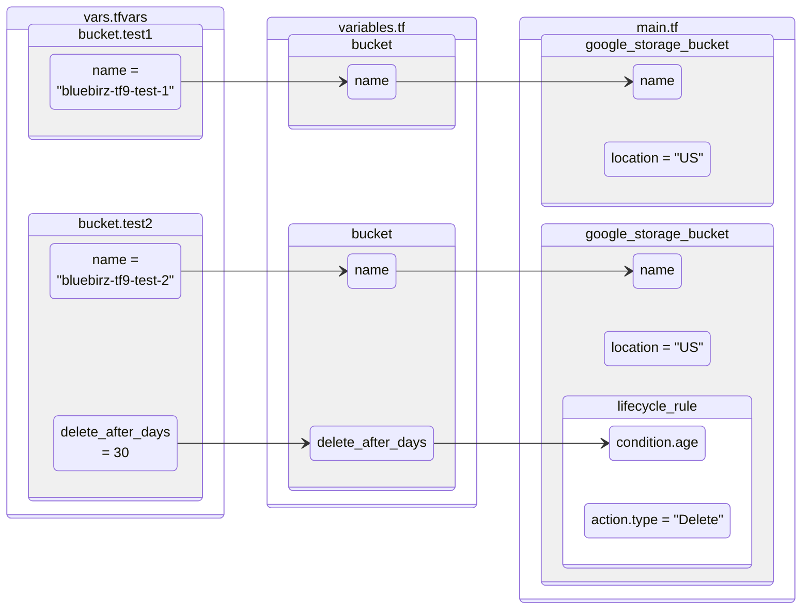
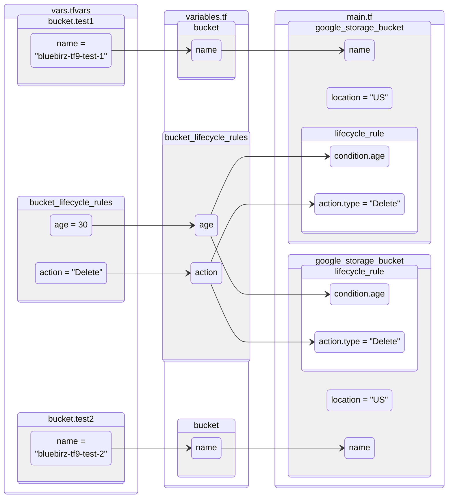




There is a situation we need to create a resource with complex nested blocks then we can consider this block type to facilitate the flexibility of our code.

It's `dynamic` block.

---

## `dynamic` block

`dynamic` block is used to generate nested blocks within a resource or module based on a collection of values. It allows you to create complex configurations dynamically, making your Terraform code more flexible and reusable.

However, using too many `dynamic` blocks can cause readability problems from its multi-levels and iterations. So use it when necessary.

---

## Syntax

`dynamic` block must have `content` block inside with `for_each`.

Read more about `for_each` in [part 8 - Conditions and Repetition]().

```terraform
resource "<resource_type>" "<resource_name>" {
  ...
  dynamic "<block_type>" {
    for_each = <expression>
    iterator = <iterator_name> # optional, default is "<block_type>"
    content {
      attribute_1 = "<value>"
      attribute_2 = "<value>"
      ...
    }
  }
  ...
}
```

And of course, `dynamic` block can be nested.

```terraform
resource "<resource_type>" "<resource_name>" {
  ...
  dynamic "<block_type>" {
    for_each = <expression>
    content {
      attribute_1 = "<value>"
      attribute_2 = "<value>"
      
      dynamic "<nested_block_type>" {
        for_each = <expression>
        content {
          attribute_1 = "<value>"
          attribute_2 = "<value>"
          ...
        }
    }
  }
  ...
}
```

---

## Example 1: with single variables

This is more flexible way to maintain attributes per resource but it could be more redundant and repetitive if there are many resources with similar attributes.





I prepared two buckets. One with `lifecycle_rule` to delete file older than 30 days controlled by variable `delete_after_days`, and another without.

```terraform
buckets = {
  test1 = {
    name = "bluebirz-tf9-test-1"
  },
  test2 = {
    name              = "bluebirz-tf9-test-2"
    delete_after_days = 30
  },
}
```





We just need only `name` and `delete_after_days` which is optional.

```terraform
variable "buckets" {
  type = map(object({
    name              = string
    delete_after_days = optional(number)
  }))
}
```





In `dynamic` block, I evaluate `delete_after_days` to an empty array if it's null and this loop will not iterate. Otherwise, it will be an array with a single value to iterate once.

After that, I assign the value at line #12 by `lifecycle_rule.value` as `lifecycle_rule` is as same as `dynamic` type name because it's the default iterator name.

```terraform
resource "google_storage_bucket" "bucket" {
  for_each = var.buckets
  name     = each.value.name
  location = "US"
  dynamic "lifecycle_rule" {
    for_each = each.value.delete_after_days != null ? [each.value.delete_after_days] : []
    content {
      action {
        type = "Delete"
      }
      condition {
        age = lifecycle_rule.value
      }
    }
  }
}
```





Look at `google_storage_bucket.bucket["test2"]` that has `lifecycle_rule` at line #30.

```text
Terraform will perform the following actions:

  # google_storage_bucket.bucket["test1"] will be created
  + resource "google_storage_bucket" "bucket" {
      + bucket_policy_only          = (known after apply)
      + force_destroy               = false
      + id                          = (known after apply)
      + location                    = "US"
      + name                        = "bluebirz-tf9-test-1"
      + project                     = (known after apply)
      + self_link                   = (known after apply)
      + storage_class               = "STANDARD"
      + uniform_bucket_level_access = (known after apply)
      + url                         = (known after apply)
    }

  # google_storage_bucket.bucket["test2"] will be created
  + resource "google_storage_bucket" "bucket" {
      + bucket_policy_only          = (known after apply)
      + force_destroy               = false
      + id                          = (known after apply)
      + location                    = "US"
      + name                        = "bluebirz-tf9-test-2"
      + project                     = (known after apply)
      + self_link                   = (known after apply)
      + storage_class               = "STANDARD"
      + uniform_bucket_level_access = (known after apply)
      + url                         = (known after apply)

      + lifecycle_rule {
          + action {
              + type          = "Delete"
                # (1 unchanged attribute hidden)
            }
          + condition {
              + age                    = 30
              + matches_storage_class  = []
              + with_state             = (known after apply)
                # (3 unchanged attributes hidden)
            }
        }
    }

Plan: 2 to add, 0 to change, 0 to destroy.
```





This example can be drawn to diagram below. Each arrow shows how the value flows from tfvars to variables and at last to resources.



---

## Example 2: with multiple variables

We can decouple variables for resources and `dynamic` block in some cases, like making shared variables.

So the example design could look like this.





From the variable file, we can maintain buckets as a map and separately keep `lifecycle_rules` as a single object.

```terraform
buckets = {
  test1 = {
    name = "bluebirz-tf9-test-1"
  },
  test2 = {
    name = "bluebirz-tf9-test-2"
  },
}

bucket_lifecycle_rules = {
  age    = 30
  action = "Delete"
}
```





Here we maintain buckets and `lifecycle_rules` separately.

```terraform
variable "buckets" {
  type = map(object({
    name = string
  }))
}

variable "bucket_lifecycle_rules" {
  default = null
  type = object({
    age    = number
    action = string
  })
}
```





For this example, I assign a separated variable `var.bucket_lifecycle_rules` to maintain `dynamic` block for `lifecycle_rule`

After `for_each` is evaluated (line #6), it would be an array having `var.bucket_lifecycle_rules` itself or nothing.

And we refer the variable in the `content` (line #9 & #12) rather than `each.value` from the iteration as in the previous example.

```terraform
resource "google_storage_bucket" "bucket" {
  for_each = var.buckets
  name     = each.value.name
  location = "US"
  dynamic "lifecycle_rule" {
    for_each = var.bucket_lifecycle_rules == null ? [] : [var.bucket_lifecycle_rules]
    content {
      action {
        type = var.bucket_lifecycle_rules.action
      }
      condition {
        age = var.bucket_lifecycle_rules.age
      }
    }
  }
}
```





According to the Terraform script, our buckets of both will have the same `lifecycle_rule` (line #16 & #43) that is to delete objects after 30 days.

```text
Terraform will perform the following actions:

  # google_storage_bucket.bucket["test1"] will be created
  + resource "google_storage_bucket" "bucket" {
      + bucket_policy_only          = (known after apply)
      + force_destroy               = false
      + id                          = (known after apply)
      + location                    = "US"
      + name                        = "bluebirz-tf9-test-1"
      + project                     = (known after apply)
      + self_link                   = (known after apply)
      + storage_class               = "STANDARD"
      + uniform_bucket_level_access = (known after apply)
      + url                         = (known after apply)

      + lifecycle_rule {
          + action {
              + type          = "Delete"
                # (1 unchanged attribute hidden)
            }
          + condition {
              + age                    = 30
              + matches_storage_class  = []
              + with_state             = (known after apply)
                # (3 unchanged attributes hidden)
            }
        }
    }

  # google_storage_bucket.bucket["test2"] will be created
  + resource "google_storage_bucket" "bucket" {
      + bucket_policy_only          = (known after apply)
      + force_destroy               = false
      + id                          = (known after apply)
      + location                    = "US"
      + name                        = "bluebirz-tf9-test-2"
      + project                     = (known after apply)
      + self_link                   = (known after apply)
      + storage_class               = "STANDARD"
      + uniform_bucket_level_access = (known after apply)
      + url                         = (known after apply)

      + lifecycle_rule {
          + action {
              + type          = "Delete"
                # (1 unchanged attribute hidden)
            }
          + condition {
              + age                    = 30
              + matches_storage_class  = []
              + with_state             = (known after apply)
                # (3 unchanged attributes hidden)
            }
        }
    }

Plan: 2 to add, 0 to change, 0 to destroy.
```





Here is the diagram showing how values flow for this example.



---

`dynamic` block is useful when we need some flexibility but we also need to leverage with simplicity in the time we are fixing it.

I decided to finish the series here. However, I will write more Terraform blogs as soon as I have some interesting stuffs.

---

## References

- [Dynamic Blocks - Configuration Language \| Terraform \| HashiCorp Developer](https://developer.hashicorp.com/terraform/language/expressions/dynamic-blocks)
- [Understanding Terraform Dynamic Blocks with Examples](https://kodekloud.com/blog/terraform-dynamic-block/)
