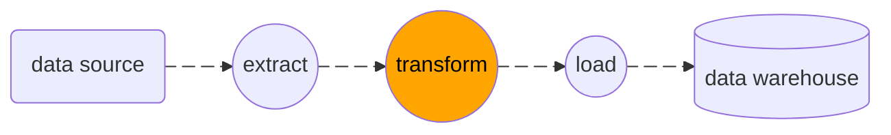

<!--  -->

**dbt** is a tool known very well for data engineers and other data expertises. Then why we have to know this?

---

## What is dbt?

**dbt** stands for "data build tool". This tool works great for data transformation in the modern stack.

dbt provides functionality to control the transformation flow into streamlines. Every tables and views can refer and can be referred to each other. We can make it through SQL and Jinja syntax.

Below is the homepage of dbt.



---

## Advantages

dbt allows us to manage the pipelines by the following features:

1. writing just SQL and Jinja is enough to run dbt.
1. supports many data warehouses such as [Snowflake](https://www.snowflake.com/), [BigQuery](https://cloud.google.com/bigquery), [Redshift](https://aws.amazon.com/redshift/), [Postgres](https://www.postgresql.org/), [DuckDB](https://duckdb.org/) and many more.
1. organize scripts in a well structure with references in-use so maintaining data streamline is simply comprehensible.
1. build documentation so easily.
1. able to implement functions — `macros` — to process complex logics and routines.
1. external libraries are available to install.
1. easy to build and run tests.
1. open-source and self-host option (dbt core), while dbt cloud is also available.
1. great developer community to support.

---

## Concepts

There are several concepts in dbt we should know then we can make use of dbt in full capacity.

### <i class="fa-solid fa-file-lines"></i> Seeds

**Seeds** are files in CSV format. We can use seeds to load small static data into the data warehouse.

### <i class="fa-solid fa-database"></i> Sources

**Sources** are the tables or views in the data warehouse. We can use sources to refer in our models.

We can define sources by referring:

- `database` (equivalent to `project` in BigQuery)
- `schema` (equivalent to `dataset` in BigQuery)
- `table` (refer to the table or view name)

### <i class="fa-solid fa-hexagon-nodes"></i> Models

This is one of core concepts of dbt.

**Models** are SQL select statements files. One model means one table or one view, by default it's a view and the file name is used as the table or view name.

A model can configure **source**, **materializations**, **macros**, and **hooks** into a single file.

### <i class="fa-solid fa-cubes-stacked"></i> Materializations

**Materializations** are strategies to maintain models. There are 5 types:

1. **View**
    - Default materialization of a model.
    - This view type is like a masquerade to run a given query over the real tables or other views.
    - Best for insignificant transformation such as columns selection, renaming, filtering.
1. **Table**
    - Physical table to store data.
    - This table type will rebuild the table every time the model runs.
    - Best for long-running transformation or heavy computation.
1. **Incremental**
    - Data insertion or update to the existing table.
    - Needs extra configurations to handle the insert/update logics.
    - Best for transactional data or optimizing the processing time.
1. **Ephemeral**
    - Functions like CTE (Common Table Expression) in SQL.
    - This type will not create any table or view so we can't select directly from this.
    - Best for simple - intermediate transformation or data preparation.
1. **Materialized views**
    - Combination of a view and a table.
    - This type is supported in some data warehouses such as BigQuery, Redshift, Snowflake.
    - Materialized views store the result of a query having joins, aggregations, and windows functions beforehand and can be refreshed periodically.
    - Best for optimizing the performance of complex queries.

### <i class="fa-solid fa-camera"></i> Snapshots

**Snapshots** are models to keep historical records of a table. We can use snapshots to track changes in the source data over time.

### <i class="fa-solid fa-gears"></i> Macros

**macros** are functions written in Jinja. We can use macros to handle complex logics or routines.

For example:

- A macro to compute latest timestamp of a table in order to run incremental models.
- A macro to add run logs to a logging table.

### <i class="fa-solid fa-toggle-on"></i> Hooks

**Hooks** are SQL statements that run before or after models run. We can use hooks to prepare the environment or clean up the resources.

### <i class="fa-solid fa-magnifying-glass-chart"></i> Analyses

**Analyses** are SQL select statements files like models but they are not part of the transformation flow. We can use analyses for ad-hoc queries or data exploration.

### <i class="fa-solid fa-vial-circle-check"></i> Tests

dbt offers two ways of tests:

1. Generic tests
    - May be known as schema tests.
    - Predefined tests such as `unique`, `not_null`, `accepted_values`, `relationships` and more.
    - We can configure these tests in a YAML file.
1. Singular tests
    - May be known as data tests.
    - Custom SQL select statements that return zero rows to pass the tests.
    - We can create singular tests in SQL file inside the `tests` directory.

### <i class="fa-solid fa-paintbrush"></i> Jinja

dbt uses SQL to run queries for data transformation and uses Jinja to control the flow, define variables, calling macros, etc.

Read my blog about Jinja below:



### <i class="fa-solid fa-cart-shopping"></i> Packages

Packages are external libraries to extend the functionality of dbt. There are many packages available in [dbt Hub](https://hub.getdbt.com/).

---

So this is a first chapter of my new series of dbt. Stay tuned for the new one.

---

## References

- [Materializations \| dbt Developer Hub](https://docs.getdbt.com/docs/build/materializations)
- [CTE in SQL - GeeksforGeeks](https://www.geeksforgeeks.org/sql/cte-in-sql/)
- [dbt snapshot Command: Strategies & Examples - PopSQL](https://popsql.com/learn-dbt/dbt-snapshot)
- [Model Materializations \| Paradime Help Docs](https://docs.paradime.io/app-help/concepts/dbt-fundamentals/model-materializations)
- [Optimizing Materialized Views with dbt \| dbt Developer Blog](https://docs.getdbt.com/blog/announcing-materialized-views)
