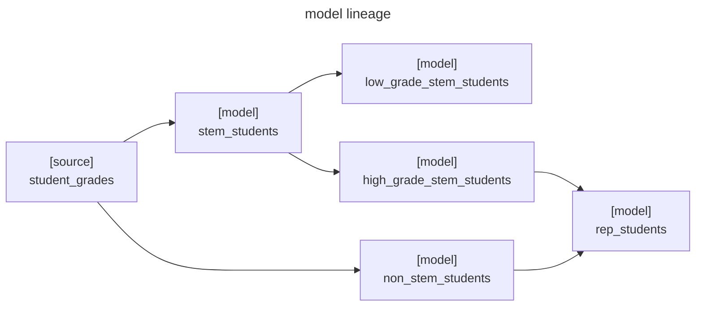





I believe that documentation is also a thing. We developed something but if no one could understand it even after reading your papers then it isn't a good product.

In this blog, we're gonna see how dbt manages the flow and docs for us.

---

## Model listing

DAG stands for Directed Acyclic Graph. We make models like a river. First model is referred by the second and so on.

dbt can show us the models we created with the command.

```sh
dbt ls
```

This command will list all models we have.

For example, we have models in this kind of relationship:



We should see the list result as follows:

```sh
$ dbt ls

bbz_dbt_test_project.students.high_grade_stem_students
bbz_dbt_test_project.students.low_grade_stem_students
bbz_dbt_test_project.students.non_stem_students
bbz_dbt_test_project.students.rep_students
bbz_dbt_test_project.students.stem_students
source:bbz_dbt_test_project.students.student_grades
```

---

## Model selection

There are some flags to select models we need to command at a time.

### Filter

In dbt, we can simply select or exclude particular models using flag `--select` and/or `--exclude` when we execute commands such as `ls`, `build`, `run`, `test`, etc.

```sh
# select
dbt ls --select <model name, path, state, tag, package, etc.>
dbt ls -s <model name, path, state, tag, package, etc.>

# exclude
dbt ls --exclude <model name, path, state, tag, package, etc.>
```

### Graph operator

We may make use of `+` as a graph operator to define numbers of ancestors (parents of the model) and descendants (children of the model) and `@` for selecting every models related to a selected model.

For example:

```sh
# select a model and 1-level ancestors
dbt ls -s 1+model

# select a model and 3-level ancestors
dbt ls -s 3+model

# select a model and all level ancestors
dbt ls -s +model

# select a model and 1-level descendants
dbt ls -s model+1 

# select a model and 3-level descendants
dbt ls -s model+3

# select a model and all level descendants
dbt ls -s model+

# select a model and 1-level ancestors plus 1-level descendants
dbt ls -s 1+model+1

# select a model and 3-level ancestors plus 3-level descendants
dbt ls -s 3+model+3

# select a model and all level ancestors plus all level descendants
dbt ls -s +model+

# select a model and all level ancestors plus all level descendants plus all level dependencies
dbt ls -s @model
```

### Some examples

Single model
: ```sh
  $ dbt ls -s high_grade_stem_students

  bbz_dbt_test_project.students.high_grade_stem_students

  ```

  ```mermaid
  flowchart LR
    grade["[source]<br>student_grades"]
    stem["[model]<br>stem_students"]
    lowstem["[model]<br>low_grade_stem_students"]
    highstem["[model]<br>high_grade_stem_students"]
    nonstem["[model]<br>non_stem_students"]
    rep["[model]<br>rep_students"]

    grade --> stem --> lowstem
    stem --> highstem --> rep
    grade --> nonstem --> rep

    classDef hl stroke:orange,stroke-width:3px;
    highstem:::hl
  ```

Multiple models
: ```sh
  $ dbt ls -s high_grade_stem_students non_stem_students

  bbz_dbt_test_project.students.high_grade_stem_students
  bbz_dbt_test_project.students.non_stem_students

  ```

  ```mermaid
  flowchart LR
    grade["[source]<br>student_grades"]
    stem["[model]<br>stem_students"]
    lowstem["[model]<br>low_grade_stem_students"]
    highstem["[model]<br>high_grade_stem_students"]
    nonstem["[model]<br>non_stem_students"]
    rep["[model]<br>rep_students"]

    grade --> stem --> lowstem
    stem --> highstem --> rep
    grade --> nonstem --> rep

    classDef hl stroke:orange,stroke-width:3px;
    highstem:::hl
    nonstem:::hl
  ```
  
Model with ancestors
: ```sh
  $ dbt ls -s 2+high_grade_stem_students
  
  bbz_dbt_test_project.students.high_grade_stem_students
  bbz_dbt_test_project.students.stem_students
  source:bbz_dbt_test_project.students.student_grades

  ```

  ```mermaid
  flowchart LR
    grade["[source]<br>student_grades"]
    stem["[model]<br>stem_students"]
    lowstem["[model]<br>low_grade_stem_students"]
    highstem["[model]<br>high_grade_stem_students"]
    nonstem["[model]<br>non_stem_students"]
    rep["[model]<br>rep_students"]

    grade --> stem --> lowstem
    stem --> highstem --> rep
    grade --> nonstem --> rep

  classDef hl stroke:orange,stroke-width:3px;
    highstem:::hl
    stem:::hl
    grade:::hl
  ```

Model with descendants
: ```sh
  $ dbt ls -s high_grade_stem_students+2
  
  bbz_dbt_test_project.students.high_grade_stem_students
  bbz_dbt_test_project.students.rep_students

  ```

  ```mermaid
  flowchart LR
    grade["[source]<br>student_grades"]
    stem["[model]<br>stem_students"]
    lowstem["[model]<br>low_grade_stem_students"]
    highstem["[model]<br>high_grade_stem_students"]
    nonstem["[model]<br>non_stem_students"]
    rep["[model]<br>rep_students"]

    grade --> stem --> lowstem
    stem --> highstem --> rep
    grade --> nonstem --> rep

    classDef hl stroke:orange,stroke-width:3px;
    highstem:::hl
  rep:::hl
  ```

Model with both ancestors and descendants
: ```sh
  $ dbt ls -s +high_grade_stem_students+
  
  bbz_dbt_test_project.students.high_grade_stem_students
  bbz_dbt_test_project.students.rep_students
  bbz_dbt_test_project.students.stem_students
  source:bbz_dbt_test_project.students.student_grades

  ```

  ```mermaid
  flowchart LR
    grade["[source]<br>student_grades"]
    stem["[model]<br>stem_students"]
    lowstem["[model]<br>low_grade_stem_students"]
    highstem["[model]<br>high_grade_stem_students"]
    nonstem["[model]<br>non_stem_students"]
    rep["[model]<br>rep_students"]

    grade --> stem --> lowstem
    stem --> highstem --> rep
    grade --> nonstem --> rep

    classDef hl stroke:orange,stroke-width:3px;
    highstem:::hl
    rep:::hl
  stem:::hl
    grade:::hl
  ```

Model with all ancestors, descendants, and dependencies
: ```sh
  $ dbt ls -s @high_grade_stem_students
  
  bbz_dbt_test_project.students.high_grade_stem_students
  bbz_dbt_test_project.students.non_stem_students
  bbz_dbt_test_project.students.rep_students
  bbz_dbt_test_project.students.stem_students
  source:bbz_dbt_test_project.students.student_grades

  ```

  ```mermaid
  flowchart LR
    grade["[source]<br>student_grades"]
    stem["[model]<br>stem_students"]
    lowstem["[model]<br>low_grade_stem_students"]
    highstem["[model]<br>high_grade_stem_students"]
    nonstem["[model]<br>non_stem_students"]
    rep["[model]<br>rep_students"]

    grade --> stem --> lowstem
    stem --> highstem --> rep
    grade --> nonstem --> rep

    classDef hl stroke:orange,stroke-width:3px;
  highstem:::hl
    nonstem:::hl
    rep:::hl
    stem:::hl
    grade:::hl
  ```

  > `non_stem_students` has been included because it's a dependency of `rep_students` which is a descendant of the selected model.
  {: .prompt-info }

Model with all ancestors, descendants, dependencies but exclude itself
: ```sh
  $ dbt ls -s @high_grade_stem_students --exclude high_grade_stem_students
  
  bbz_dbt_test_project.students.non_stem_students
  bbz_dbt_test_project.students.rep_students
  bbz_dbt_test_project.students.stem_students
  source:bbz_dbt_test_project.students.student_grades

  ```

  ```mermaid
  flowchart LR
    grade["[source]<br>student_grades"]
    stem["[model]<br>stem_students"]
    lowstem["[model]<br>low_grade_stem_students"]
    highstem["[model]<br>high_grade_stem_students"]
    nonstem["[model]<br>non_stem_students"]
    rep["[model]<br>rep_students"]

  grade --> stem --> lowstem
    stem --> highstem --> rep
    grade --> nonstem --> rep

    classDef hl stroke:orange,stroke-width:3px;
    nonstem:::hl
    rep:::hl
    stem:::hl
    grade:::hl
  ```

---

## Docs

We can see how to list and select models. The thing is dbt has a feature to generate documentation to understand models so easily.

There are 2 commands for docs in dbt.

```sh
dbt docs generate
dbt docs serve
```

And after waiting for few seconds, the docs should be popped up in a browser like this.


Here we can play around and view the lineage of each model.

<video width="100%" controls>
   <source src="{{ page.media_dir }}docs-showcase.mov" type="video/mp4">
   Your browser does not support the video tag.
</video>

---

## Wrap up

- `dbt ls` to list models
- `--select` to select models
- `--exclude` to exclude models
- selection flags can be use with `ls`, `compile`, `run`, `build`, `test`, etc.
- `+` to extend the model selection
- `@` to select whole relationship from the selected models, including all ancestors, descendants, and dependencies.
- `dbt docs generate` and `dbt docs serve` to create and view docs.

---

## References

- [Node selection \| Syntax overview \| dbt Developer Hub](https://docs.getdbt.com/reference/node-selection/syntax)
- [About dbt docs commands \| dbt Developer Hub](https://docs.getdbt.com/reference/commands/cmd-docs)
