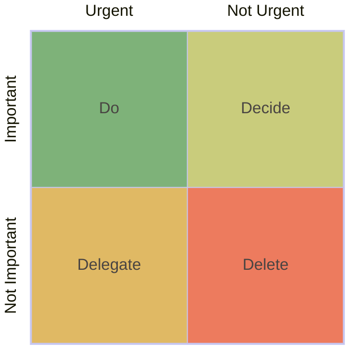

By the end of the week, workers may say "Thanks gods, It's Friday" but some may get on fire from unfinished tasks and unplanned works then have bad sleep till Monday.

So far I have worked with people, engineers and business person, and there are something I'd like to share about how could we handle the tasks of either work-related or personal ones throughout some framework, **PDCA**.

---

## PDCA

"PDCA" stands for "Plan-Do-Check-Act" and this is a framework for managing tasks in thoughtful methods. It could be called in various names; "Plan-Do-Check-Adjust", "Shewchart cycle", "Control circle", or "Control cycle".

PDCA consists of:

- **Plan** tasks to do.
- **Do** tasks from the plan.
- **Check** the results we did.
- **Act** or adjust to improve.

So here I'd explain in my case what I have adapted this PDCA framework into my works.

---

## P - Plan

First of everything, we have a pile of tasks to do but we don't know which one to do first. We need to comprehend what is each task and writing user stories may help.

### User stories

User story is a term in product development to explain what, why, when, how of the tasks.

We write task title in the format "As a [user], I want [goal] so that [reason]." and articulate details inside the story.

*For example*, "As a data engineer, we need to deploy new financial jobs of taxation so data consumers can calculate taxes properly."

### Eisenhower matrix

Now we understand the overview of those tasks and we can classify them with **Eisenhower matrix**. This matrix is a simple quadrant diagram that helps us classify how could we deal with this task based on importance and urgency.

In each quadrant, we put the tasks and stuffs into each of the quadrants.

1st quadrant: Do
: Tasks in here needs extra attentions and **do** it as soon as possible or it will be too late. There are important and urgent tasks and I usually find the kind of task in forms of critical incidents.

  *For example*, a very important financial model failed.

2nd quadrant: Decide
: The tasks here usually are the daily works that we need to build, to fix, to enhance, but not in urgent or are able to schedule later. We need to **decide** or **prioritize** them for which one should be focus first and so on. However, we need to keep them in radar or they could become too urgent to handle.

  *For example*, new financial jobs must be deployed on time.

3rd quadrant: Delegate
: The tasks in this quadrant are urgent but not much important. They are needed to do soon but it can be anyone, not must be me so we can **assign** other people to do the task for me.

  *For example*, new financial jobs need to be integrated with internal notification system.

4th quadrant: Delete
: And the last quadrant, Delete. This is not important nor urgent. After those 3 quadrants, the rest falls here so we can list them here as "do it when we have time" thingies or **dispose** them away.

  *For example*, the documentation of the new financial jobs would have developed in red theme.

### Backup and fallback plans

A perfect plan doesn't exist. Therefore, we should have backup plans if the initial plan was failed and fallback plan if possible to reduce risks.

*For example*, If the new financial jobs failed on deployment, we need to retreat all settings with the first script and run the second script to generate data files for the meeting tomorrow as a workaround.

### Tools

There are many tools to help us manage user stories such as:

- [JIRA](https://www.atlassian.com/software/jira)
- [Trello](https://trello.com)
- [Monday.com](https://monday.com)
- [OpenProject](https://www.openproject.org)
- [Asana](https://asana.com)
- [Focalboard](https://www.focalboard.com)
- Notetaking apps like Obsidian ([old blog: Obsidian]()) or any to-do apps.
- and other apps.

---

## D - Do

Now we have a list of task to do. Here is what I usually do when I start working.

1. **Set time frame**  
  There are different terms like "man-day", "story points", or else. Giving time frame helps me see and track how much time I have spent on a task, and next time I can assess the similar tasks and solve them more efficiently.
2. **Handle stress**  
  When I can't solve it in time or I'm cornered, these are what I often choose to do:
    - *Extract*: I am confident to solve and pay more attention to find out the core and work on it.
    - *Retract*: I would step back and discuss with other people or AI companions (in some cases). Two heads are better than one right?
    - *Distract*: I distract myself to think about other things or relax before turning back to the task again.
3. **Track progress**  
  I'm not good at memorizing things then I jot my progress, concerns, questions, or whatever in the user stories (or notes) so I can comeback anytime to see what was happened there and improve later.

---

## C - Check

Now the tasks are done. We check the results and evaluate between what we plan to get and what we actually get.

The progress I have tracked are there in the user stories so I just read again to searching rooms for improvements along with comparing between the expectations and real outcomes. Many times I have knowledge sharing sessions to express my ideas to improve the works. And it would be super great opportunity if we are not getting only product outcomes but also feedbacks to upgrade the working environments ([old blog: Note of training - Constructive feedback]()).

By Agile process, this "check" stage could be taken in sprint retrospective in scrum ceremony. However, I do it personally after finishing each task.

---

## A - Act

After the "check" there probably are several items for improvements and feedback. And they will become new user stories in the "plan" stage and be arranged in Eisenhower matrix again.

---

## References

- [The Eisenhower Matrix: How to Prioritize Your To-Do List \[2025\] • Asana](https://asana.com/resources/eisenhower-matrix)
- [PDCA - Wikipedia](https://en.wikipedia.org/wiki/PDCA)
- [User stories with examples and a template \| Atlassian](https://www.atlassian.com/agile/project-management/user-stories)
