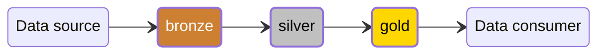



"Medallion architecture" is one of database design principles and I have dealt with this for years. Let's talk about it and decide if our next projects will use this Medallion structure or not.

---

## What's Medallion structure

**Medallion structure** is a common term meaning a structure of storing and processing data. It divides by 3 parts:



### Bronze layer

Bronze layer is a layer of raw data. We store unprocessed data here with **no transformation**.

- Metadata fields e.g. `created_at` and `updated_at` are recommended to be added as it's useful for data lineage and incident investigation.
- Naming convention in this layer could be these suffixes/prefixes: `raw`, `L0`, `staging`, or `stg`.
- For example, `user_interactions_raw` dataset holds data from Google Analytics, showing user interactions like clicking links and playback video.

### Silver layer

This silver layer is the **cleansed** layer.

- Data cleansing, data filtering, and data augmentation performed in this layer.
- Naming convention suffixes/prefixes here could be: `refine`, `L1`, `transform`, `trf`.
- For example, `user_interactions_trf` dataset stores only login user interactions with specific criteria e.g. watch time duration, article reading, enter sites from affiliate links.

### Gold layer

And the gold layer is the one **ready to be used** by data consumers.

- Business-logics and aggregation applied here.
- Naming convention suffixes/prefixes could be: `report`, `L2`, `serve`, `srv`.
- For example, `movie_watcher` dataset is aggregated from `user_interactions_trf` and `movie_list`, showing users who watched particular movies within specific criteria.

### More examples

1. From `raw` in bronze layer, silver layer is split to `staging` which is a cleansed data and `warehouse` which is fulfilled and augmented data.

    ```mermaid
    stateDiagram-v2 
      direction LR
      classDef brz fill:#CD7F32,stroke-width:2
      classDef slv fill:#C0C0C0,stroke-width:2
      classDef gld fill:#FFD700,stroke-width:2
      classDef wht color:white,stroke:gray
      classDef blk color:black,stroke:gray

      state "Data source" as src
      state "Data consumer" as usr
      b: bronze
      state b {
        state "raw" as r
      }
      s: silver 
      state s {
        state "staging" as stg
        state "warehouse" as wh
      }
      g: gold
      state g {
        state "mart" as m
      } 

      class b,r brz
      class s,stg,wh slv
      class g,m gld
      class r wht
      class stg,wh,m blk

      src --> r
      r --> stg
      stg --> wh 
      wh --> m 
      m --> usr
    ```

1. From `raw` in bronze layer, silver layer is split to `stg` which is cleansed and fulfilled but keep alive for short period from streaming data, and `hst` keeps all historical data from `stg`.

    ```mermaid
    stateDiagram-v2 
      direction LR
      classDef brz fill:#CD7F32,stroke-width:2
      classDef slv fill:#C0C0C0,stroke-width:2
      classDef gld fill:#FFD700,stroke-width:2
      classDef wht color:white,stroke:gray
      classDef blk color:black,stroke:gray

      state "Streaming<br/>Data source" as src
      state "Data consumer" as usr
      b: bronze
      state b {
        state "raw" as r
      }
      s: silver 
      state s {
        state "stg" as stg
        state "hst" as hst
      }
      g: gold
      state g {
        state "srv" as srv
      } 

      class b,r brz
      class s,stg,hst slv
      class g,srv gld
      class r wht
      class stg,hst,srv blk

      src --> r
      r --> stg
      stg --> hst
      hst --> srv
      srv --> usr
    ```

---

## Pros & Cons

Medallion structure is great and popular for everyone because:

- **Decoupling**: We can immediately understand the purpose and perform data quality check at each layer.
- **Traceability**: Incident investigation and rollback can perform easier.
- **Reusability**: Modular assets can be used across multiple downstream domain.

But there are some trade-offs:

- **Cost**: Multiple layers mean more cost and space to store.
- **Latency and dependency**: Adding steps between layers is to add complexity on those.
- **Data governance overhead**: Need to comply with sensitive data protection in the early layer, like bronze or silver layer.

---

Good design infrastructure must be the first and we won't worry much later.

---

## References

- [Post of Riya KhandelwalRiya Khandelwal \| LinkedIn](https://www.linkedin.com/posts/riyakhandelwal_dataengineering-databricks-medallionarchitecture-activity-7352340032986234881-tNCj)
- [The Medallion Data Architecture (Pros & Cons) \| YouTube](https://youtu.be/8p77fOWp5F4)
